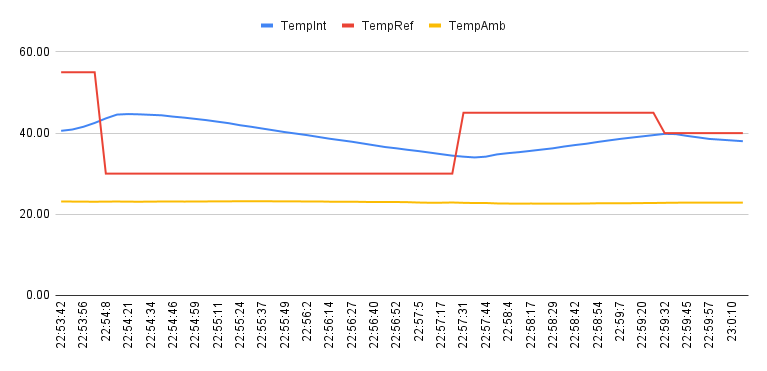
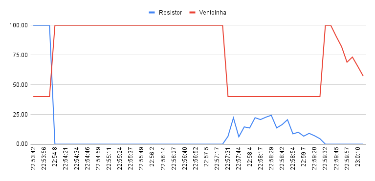

# FSE - Trabalho 2: Forno PCB

## Apresentação

[Vídeo](https://www.youtube.com/watch?v=2gQR3qCsIzM)

## Experimento - Temperatura Fixa

### Temperaturas



### Sinais



## Executando

Instale as dependências e rode

```sh
python3 main.py
```
